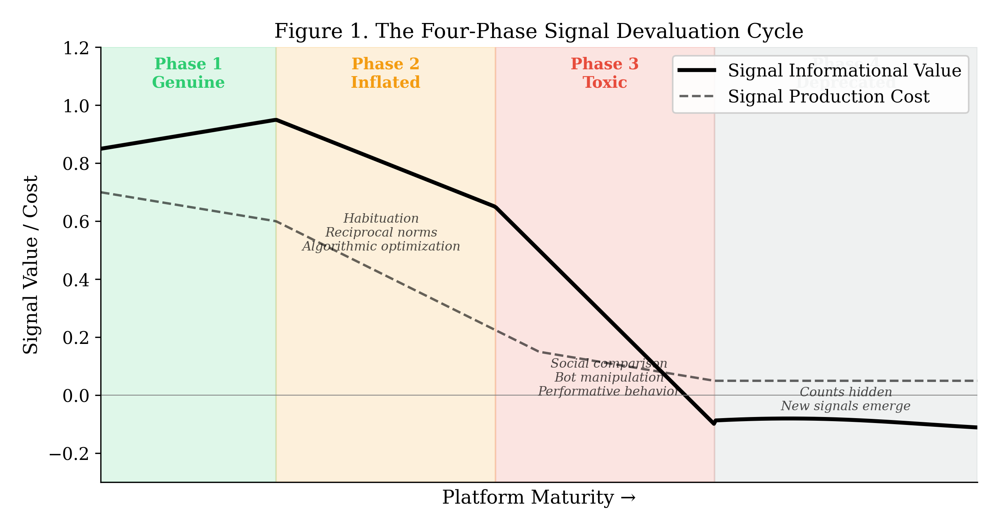
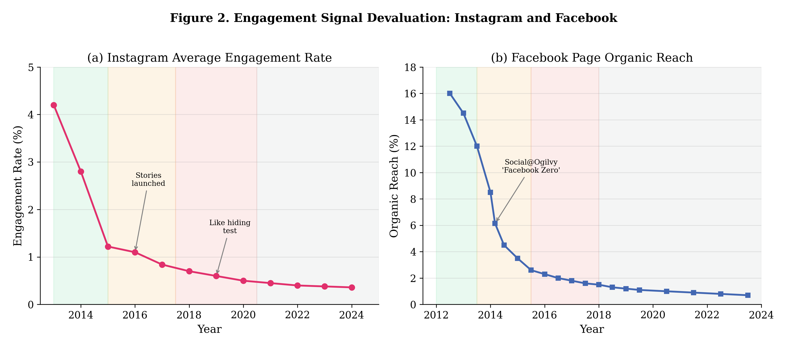
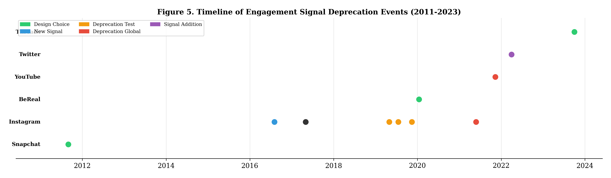
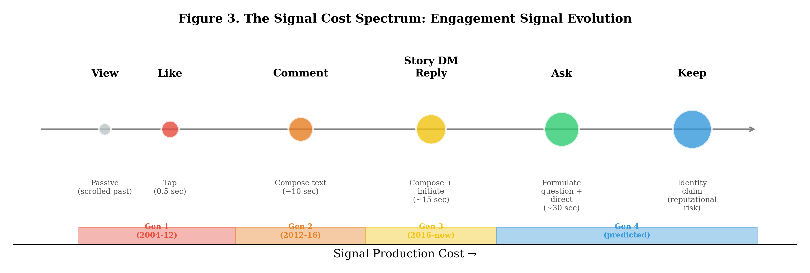
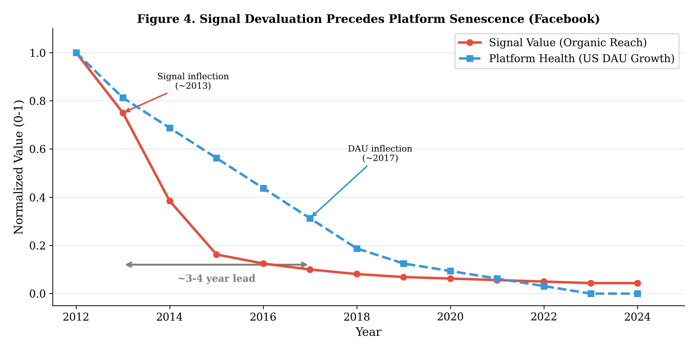

# The Signal Inflation Hypothesis: Why Engagement Signals Lose Value and What Replaces Them

---

## Abstract

The Facebook "like" button, introduced in 2009, became the universal unit of social media engagement within two years. Sixteen years later, that unit is in collapse. Instagram's average engagement rate fell from 1.22% to 0.36% between 2015 and 2024; Facebook's organic reach dropped from 16% to under 1.5% between 2012 and 2023. In 2019, Instagram began *hiding* like counts — the platform deliberately obscuring the metric it had spent a decade optimizing. Standard accounts of this decline invoke algorithmic changes, content saturation, or platform maturity. These describe correlates, not mechanisms. This paper introduces the **Signal Inflation Hypothesis**: engagement signals follow a devaluation cycle isomorphic to monetary inflation. Drawing on Spence's (1973) signaling theory, we show that as a signal's production cost approaches zero — through habituation, reciprocal norms, algorithmic optimization, and automated manipulation — its informational value collapses. We formalize a four-phase **Signal Devaluation Cycle** (genuine → inflated → toxic → deprecated), trace the like button's complete passage through all four phases, and demonstrate that signal devaluation precedes platform-level stagnation by approximately 4–6 years across like-centric platforms (Facebook, Instagram), with Snapchat's structurally high-cost signal serving as a counter-example. We then propose a **Signal Cost Spectrum** that maps engagement signals by production cost and predicts that the next dominant signal will operate at the identity level — not "I noticed this" but "this shaped who I am."

**Keywords**: engagement signals, signaling theory, social media, platform design, like button, signal inflation

---

## 1. Introduction

On February 9, 2009, Facebook shipped a feature its designers considered minor: a thumbs-up icon beneath every post. One click. No text required. The "Like" button took two years to become the universal currency of online social life. Instagram adopted it in 2010. Twitter rebranded its stars as hearts. YouTube, Reddit, Pinterest, LinkedIn, TikTok — every platform of consequence introduced some variant of the same idea. A binary approval signal. Tap once. Move on.

Sixteen years later, that currency is worthless.

Instagram's engagement rate — likes and comments divided by followers — has dropped roughly 70%, from 1.22% in 2015 to 0.36% in 2024 (Rival IQ, 2016–2025). Facebook's organic reach collapsed from 16% in 2012 to under 1.5% by 2023 (Edgerank Checker, 2013; Locowise, 2018). These numbers are remarkable on their own, but what happened next is more remarkable still. In July 2019, Instagram began testing hidden like counts in Canada. By 2021, the option was available globally. The same year, YouTube removed public dislike counts. Two of the world's largest platforms chose to *conceal* the very metrics they had built their empires on.

Why? The standard explanations — algorithmic changes that suppress organic content, increased competition for user attention, natural platform maturity — are not wrong, exactly. They describe what happened. They do not explain why it was inevitable. They cannot answer the harder question: why did the most effective engagement tool ever designed become something platforms actively hide from their own users?

The answer, we believe, lies in signal economics. A "like" is not a UI element. It is a **signal** in the formal sense defined by Spence (1973): an observable action whose value derives from its cost of production. Education signals ability because it is expensive to acquire. A handwritten letter signals care because it takes time to compose. And a like, in 2009, signaled genuine attention because users made conscious, deliberate decisions about which content to endorse. The problem is that likes became free. Not literally free — they always required only a tap — but *cognitively* free: habituated, socially obligated, algorithmically elicited, and ultimately automated. When signal production cost approaches zero, informational value approaches zero with it.

We call this process **signal inflation**. We use the analogy to monetary economics as a structured comparison rather than a formal homology: when a central bank expands the money supply, each unit loses purchasing power; when a platform makes engagement signals cheap to produce, each signal loses informational power. The two systems share a generic dependence of unit value on production cost, but the underlying mechanisms (central-bank policy versus platform engagement-optimization) and the observable variables (purchasing power versus informational content) are not isomorphic in the strict mathematical sense. We use the comparison to motivate the model and to import the well-developed Gresham's Law intuition — bad money drives out good — to its social-media analogue: bad likes drive out good ones, because recipients cannot distinguish genuine expressions of attention from reflexive taps when both occupy the same channel. The argument that follows does not depend on the homology being exact; it depends only on the cost-to-value dependence holding in both domains.

This paper makes four contributions. First, we formalize signal inflation and the monetary analogy (Section 2). Second, we identify a four-phase Signal Devaluation Cycle and trace the like button through all four phases (Section 3). Third, we analyze Instagram Stories, Snapchat, and BeReal as market responses to inflation — each restoring signal value through different mechanisms (Section 4). Fourth, we propose a Signal Cost Spectrum mapping engagement signals by production cost, and predict that the next generation will operate at the identity level (Section 5). Section 6 presents evidence that signal devaluation precedes platform decline. Sections 7 and 8 discuss implications and conclude.

---

## 2. Theoretical Framework

### 2.1 Signaling Theory Applied to Social Media

Spence's (1973) signaling model was built for labor markets, but its core logic is domain-independent: a signal conveys information precisely because it is costly to produce. Education signals ability because acquiring it requires effort that less-able individuals cannot easily replicate. Strip away the cost, and the signal becomes noise.

Donath (2007) recognized the implication for online interaction. Digital environments systematically lower signal production costs. A profile photo can be curated, a biography fabricated, and — most consequentially — approval can be expressed with a single tap. The offline equivalent of a "like" — a verbal compliment, a handwritten note, showing up in person — requires orders of magnitude more effort. The digitization of approval did not merely make it more convenient. It destroyed the cost structure that made it informative.

The formal claim is straightforward: **an engagement signal's informational value is a function of its production cost.** A new signal initially carries value because production involves conscious effort. Over time, four forces erode that cost: habituation (the signal becomes automatic), reciprocal obligation (social norms demand reciprocation), algorithmic optimization (the platform engineers frictionless production), and automation (bots produce signals at scale). As cost converges on zero, value follows.

### 2.2 The Inflation Mechanism

The parallel to monetary inflation is structured comparison, not strict isomorphism (Table 1). The two systems share the dependence of unit value on production cost, but differ in mechanisms (central-bank policy vs. platform engagement-optimization) and observables (purchasing power vs. informational content). We use the table to motivate the predictions, not to establish formal equivalence.

**Table 1.** Structured comparison between monetary and signal inflation.

| Monetary System | Social Media System |
|---|---|
| Central bank expands money supply | Platform optimizes for engagement volume |
| Purchasing power per unit declines | Informational value per signal declines |
| Inflation expectations form (wage-price spiral) | Signal expectations form ("everyone likes everything") |
| Hyperinflation → currency collapse | Signal toxification → mental health harm |
| Currency reform / re-denomination | New signal introduction (Stories DM, ephemeral formats) |

The parallel extends to Gresham's Law. When inflated likes — habitual, reciprocal, automated — circulate alongside genuine ones, recipients cannot distinguish between them. The information is gone. A user who wishes to communicate "I genuinely paid attention to this" finds that the like no longer carries that message. It has been debased. Rational actors migrate to higher-cost signals: direct messages, lengthy comments, and eventually platform features designed from the ground up to restore signal cost.

### 2.3 The Four-Phase Signal Devaluation Cycle

Signal devaluation is not gradual. It passes through four discrete phases (Figure 1).

**Phase 1 — Genuine.** The signal is novel. Production requires a conscious decision. Recipients can accurately infer intent. Signal-to-noise ratio is high. *Monetary analogue: stable currency, controlled supply.*

**Phase 2 — Inflated.** Four mechanisms compress production cost: (a) *habituation* — liking becomes reflexive rather than deliberate; (b) *reciprocal norms* — social obligation to like back ("L4L" culture); (c) *algorithmic optimization* — platform design maximizes signal production per session through notification timing, UI placement, and engagement-ranked content; (d) *engagement bait* — creators optimize for signal extraction, not quality. Signal-to-noise deteriorates. *Monetary analogue: moderate inflation eroding purchasing power.*

**Phase 3 — Toxic.** Value turns negative. The signal actively causes harm through four channels: (a) *social comparison* — visible counts enable interpersonal ranking, linked to decreased self-esteem and increased anxiety (Vogel et al., 2014; Appel et al., 2016); (b) *performative inauthenticity* — content is produced for signal maximization rather than self-expression (Duffy & Hund, 2015); (c) *automated pollution* — bots and engagement farms produce signals at industrial scale; (d) *platform weaponization* — organic reach is suppressed to force paid distribution, turning the signal against the creators who generate it. *Monetary analogue: hyperinflation where currency becomes a liability.*

**Phase 4 — Deprecated.** The platform acknowledges failure and acts: hiding counts (Instagram, 2019/2021), removing metrics (YouTube dislikes, 2021), redesigning interaction patterns entirely. Replacement signals with higher production cost emerge simultaneously. *Monetary analogue: currency reform.*

The key theoretical insight visible in Figure 1: cost reduction *precedes* value collapse. The gap between declining production cost and declining informational value widens before value turns negative in Phase 3. This lag creates a window during which the platform appears healthy (engagement numbers are up) while the signal's informational content is already hollowed out — a dynamic that explains why platforms are consistently slow to recognize signal inflation until it reaches the toxic phase.

---

## 3. The Like Button's Passage Through Four Phases

### 3.1 Phase 1: Genuine (2009–2013)

The like button launched in February 2009, and for roughly four years, it worked as designed. Users made conscious choices about what to endorse. The signal carried weight.

The evidence is in the reach numbers. In 2012, a Facebook page post reached approximately 16% of its followers organically (Edgerank Checker, 2013). That figure reflects a platform that trusted its primary engagement signal enough to use it as the backbone of content distribution. When someone liked a post, Facebook took it seriously — and distributed accordingly. Per-session like counts were lower than in subsequent periods, consistent with deliberate rather than reflexive engagement. The like was broadly perceived as a genuine expression of interest (Scissors et al., 2016). It was, in the economic sense, a sound currency.

### 3.2 Phase 2: Inflated (2013–2016)

Three forces converged to inflate the like starting around 2013.

Facebook's News Feed redesign that year made engagement the primary input to content ranking. The platform began optimizing for likes — surfacing content that generated them, which trained users to produce more, which generated more data for optimization. A feedback loop with no natural brake.

Simultaneously, "like for like" culture emerged, particularly on Instagram. The like transformed from a signal of attention to a social debt. Not reciprocating became a minor transgression. Like counts inflated while informational content diluted — exactly as the model predicts.

Content creators completed the inflation spiral by discovering engagement bait: post formats engineered to extract likes regardless of content quality. Questions, polls, emotional appeals, and outrage manufactured engagement at scale. The like became a reflex, not a judgment.

The numbers tell the story. Facebook's organic reach cratered — from 16% in 2012 to 6.15% by February 2014 to roughly 2% by 2016 (Social@Ogilvy, 2014; Locowise, 2016). As like volume exploded, each like bought less distribution. The platform had to filter more aggressively precisely because the signal it used for filtering was losing information content. Instagram's engagement rate, having peaked at approximately 4.2% during its early growth, was already falling to 1.22% by 2015 (Rival IQ, 2016) — declining *despite* rapid user growth, meaning per-user engagement was diluting faster than users were arriving. By 2016, third-party engagement-audit estimates put bot-generated Instagram interactions at roughly 8–12% of the total (HypeAuditor, 2017; Status Labs, 2018; specific point estimates vary by methodology and platform-cleanup cycle), directly inflating the signal supply.

### 3.3 Phase 3: Toxic (2016–2019)

The transition from inflation to toxification is subtle but decisive. In Phase 2, the like was merely less valuable. In Phase 3, it became a weapon.

The research record is unambiguous. Vogel et al. (2014) demonstrated that exposure to high-like profiles decreased self-esteem through upward social comparison. Appel et al. (2016) traced the full pathway: Facebook use → social comparison → envy → depression. The Royal Society for Public Health's 2017 *#StatusOfMind* report named Instagram the most harmful platform for young people's mental health, with like-count comparison as a central mechanism. In 2021, leaked internal Facebook documents confirmed what researchers had been arguing for years: "We make body image issues worse for one in three teen girls" (Wells et al., 2021). The mechanisms identified internally — social comparison, performative behavior, metric anxiety — are precisely the Phase 3 dynamics the signal inflation model predicts.

Users responded rationally. They stopped posting to their main feeds. Posting frequency declined as performance anxiety increased — the cost of *not receiving enough likes* exceeded the benefit of sharing. And they migrated to a format without public like counts. Instagram Stories, launched in August 2016, grew to 500 million daily users by 2019, exceeding main feed engagement. The market found its own exit from signal toxification before the platform did.

### 3.4 Phase 4: Deprecated (2019–Present)

In July 2019, Instagram began hiding like counts in Canada, expanding to six more countries before a global rollout in May 2021. Adam Mosseri's framing was explicit: "We want people to worry a little less about how many likes they get on Instagram and spend a bit more time connecting with the people that they care about" (Mosseri, 2019). In November 2021, YouTube removed public dislike counts. Two major platforms, within two years, deliberately obscured their foundational engagement metrics.

These are extraordinary admissions. A platform hiding its own engagement signal is analogous to a central bank recalling its own currency. It is an acknowledgment that the unit of value has become a unit of harm.

Twitter/X provides a useful control case. Under Elon Musk's ownership (2022–present), the platform has *doubled down* on engagement metrics — adding view counts, emphasizing impressions, gamifying engagement statistics. This refusal to deprecate toxic signals coincides with widely reported increases in platform toxicity, content quality deterioration, and advertiser flight. The model predicts exactly this: undeprecated toxic signals accelerate platform dysfunction.

---

## 4. Signal Cost Restoration

### 4.1 Stories as Structural Response

Snapchat Stories (2013) and Instagram Stories (2016) are conventionally understood as product innovations. The signal inflation framework reveals them as something more specific: structural responses to engagement signal collapse. They restore value through three mechanisms operating simultaneously.

**Cost restoration.** The dominant engagement signal in Stories is not a like — Snapchat Stories never had one — but a direct message reply. Composing a reply requires formulating a thought, typing it, and deliberately initiating a private conversation. This is categorically more expensive than a tap. A DM reply to a story genuinely means "I want to talk to you about this," in a way that a like on a post has not meant for years.

**Audience restriction.** Instagram's Close Friends feature (2018) limits story visibility to a curated list. By restricting the signal's audience, perceived value increases. A story viewed by 20 selected friends generates qualitatively different engagement than a post seen by 2,000 followers. The signal space is smaller, less anonymous, and harder to game.

**Creation barrier separation.** Stories expire in 24 hours. This ephemerality does not reduce signal *production* cost — replying to a story requires the same effort regardless of the story's lifespan. What it reduces is *content creation* cost. By making the content disposable, Stories lower the barrier to posting. The result is elegant: more content is created (low creation barrier) while engagement signals remain valuable (high production cost). The two costs, usually conflated, are decoupled.

### 4.2 The Ephemeral Treadmill

Stories solved signal inflation. They created a new problem.

Nothing accumulates. Content vanishes in 24 hours. Conversations sparked by story replies lose their context once the triggering story expires. Users find themselves on what we term the **Ephemeral Treadmill**: producing new content daily to maintain social presence, receiving no compound return on investment. Every day resets to zero. The relationship between two users who have exchanged a thousand story replies looks identical — in the platform's memory — to two strangers.

This is structurally significant. The Ephemeral Treadmill means Stories can restore signal *cost* but cannot create signal *accumulation*. A platform that solves both — maintaining signal cost while enabling interactions to compound into persistent, deepening value — would occupy a design space that no current platform has claimed.

### 4.3 BeReal and the Limits of Radical Deprecation

BeReal (launched 2020) took the most extreme available position: eliminate engagement signals entirely. No public likes. No follower counts. One daily post at a random time. No curation, no performance, no comparison.

The growth curve confirmed the diagnosis — BeReal surged from roughly 10,000 to 53 million DAU between 2020 and 2023. People *wanted* to escape the like. But the decline that followed confirmed a different lesson. BeReal's DAU dropped sharply through 2024 as users drifted away. Radical deprecation — removing all signals — addresses the toxification problem but destroys the motivational feedback loop. Signals, even inflated ones, serve a function: they provide evidence that someone noticed. Remove them entirely, and the platform provides no feedback, no validation, no reason to return.

The lesson is precise: the solution to signal inflation is not the elimination of signals. It is the introduction of signals with structurally higher cost — costly enough to resist inflation, meaningful enough to sustain motivation.

---

## 5. The Signal Cost Spectrum

### 5.1 A Framework for Signal Evolution

We map engagement signals by production cost, from zero-effort to identity-level commitment (Table 2, Figure 3).

**Table 2.** The Signal Cost Spectrum.

| Signal | Production Cost | What It Communicates | Platform Example |
|---|---|---|---|
| View | Passive | "I scrolled past this" | TikTok, Instagram |
| Like / Heart | Single tap | "I noticed this" | All major platforms |
| Comment | Compose text | "I have something to say about this" | All major platforms |
| DM Reply to Story | Compose + initiate | "I want to talk to you" | Instagram Stories, Snapchat |
| Directed Question | Formulate + direct to specific person | "I want to know you" | — |
| Identity Claim | Public self-commitment | "This shaped who I am" | — |

### 5.2 Generational Succession

Each generation of dominant social media is defined by its primary engagement signal:

**Generation 1 (2004–2012):** The Like. Facebook era. A low-cost signal sufficient for a novel medium where any digital acknowledgment was extraordinary.

**Generation 2 (2012–2016):** The Photo Like. Instagram era. Visual content paired with the same low-cost signal — a combination that worked until the signal inflated under the weight of scale and algorithmic optimization.

**Generation 3 (2016–present):** The Story Reply. Ephemeral era. Signal cost restored through composition and private delivery. But nothing accumulates. The Ephemeral Treadmill prevents compound returns.

**Generation 4 (predicted):** The Identity Signal. A signal costly enough to resist inflation (it requires genuine self-commitment), persistent enough to accumulate (it composes into a portrait of the self over time), and relationally specific enough to resist automation (it references a particular interaction between particular people). Such a signal — "this moment shaped who I am" — would satisfy the dual constraint that Generation 3 cannot: maintaining cost while enabling accumulation.

Each generational transition occurs when the incumbent signal inflates to the point of toxification. The transition is visible in platform behavior (signal deprecation, format innovation) and market entry by platforms offering costlier alternatives.

### 5.3 Testable Predictions

Three predictions follow:

**P1:** The next dominant social platform will organize around an engagement signal with higher production cost than the story DM reply.

**P2:** This signal will accumulate into a persistent identity representation — unlike likes (aggregated into anonymous counts) or story replies (which vanish). Each instance will be individually meaningful, attributable, and permanent.

**P3:** Platforms that structurally maintain signal cost — through design constraints, inherently costly signal mechanics, or both — will exhibit slower engagement rate decline than platforms optimizing for signal volume. Conversely, platforms that reduce signal cost to maximize engagement metrics will accelerate through the devaluation cycle.

*Disclosure: The author is developing one such product (Currot, with an identity-level engagement feature called* Keep*) as a structural test of P1–P3. Empirical validation of P1 and P2 — including direct comparison of* Keep *signal cost against the like and the story DM reply — will follow in subsequent work.*

---

## 6. Signal Devaluation Precedes Platform Senescence

### 6.1 Approach

If signal inflation *causes* platform decline rather than merely accompanying it, devaluation should temporally precede platform-level stagnation. We test this prediction across three platforms using publicly available data, defining two operational thresholds:

1. **Signal-break year** — the first year where the engagement-signal metric crosses below half of its peak observed value. (For Facebook: organic reach below 50% of 2012 peak; for Instagram: engagement rate below 50% of 2013 peak.)
2. **Platform-stagnation year** — the first year where DAU year-over-year growth halves from the platform's own historical maximum. (Computed from Meta and Snap quarterly SEC filings.)

The lag is the difference. We report two thresholds because reasonable analysts disagree on what counts as "stagnation"; the two operationalizations bound the answer.

### 6.2 Facebook (computed from Meta SEC filings 2012–2025)

Engagement-signal time series (organic reach, source `data/facebook_organic_reach.csv`):

| Year | Organic reach | % of 2012 peak | DAU YoY growth |
|---|---|---|---|
| 2012 | 15.25% (peak) | 100% | — |
| 2013 | 10.25% | 67.2% (above 50% threshold) | +24.96% (peak DAU growth) |
| 2014 | 4.72% | 30.9% (≤ 50% of peak; **signal-break year**) | +18.81% |
| 2016 | 1.90% | 12.5% | +17.09% |
| 2018 | 1.25% | 8.2% | +10.41% (DAU growth halves from 2013 peak of 24.96%; **stagnation year, half-of-peak threshold**) |
| 2022 | 0.80% | 5.2% | +3.49% (full plateau, DAU < 5%/yr threshold) |

The 2013 row is included to make the breakpoint unambiguous: 67% of peak in 2013 *did not* cross the 50% threshold; 2014 (30.9%) is the first year that does. The signal-break year is 2014, not 2013-late.

**Lag (Facebook): 4 years** (2018 stagnation − 2014 signal break). If we use the more conservative full-plateau threshold (DAU YoY < 5%, reached 2022), lag stretches to 8 years. The middle-of-road estimate is **4–6 years**.

### 6.3 Instagram (engagement rate from Rival IQ + Socialinsider)

Engagement-signal time series (`data/instagram_engagement_rate.csv`):

| Year | Engagement rate | Notes |
|---|---|---|
| 2013 | 4.20% (peak) | pre-algorithmic feed |
| 2015 | 1.22% (≤ 50% of peak; **signal-break year**) | first Rival IQ benchmark; L4L culture |
| 2016 | 1.10% | Stories launches (Aug) |
| 2017 | 0.84% (< 1% threshold) | algorithm + bot prevalence |
| 2018 | 0.70% | mental health research; posting frequency declining |

Instagram is bundled in Meta consolidated DAU/MAU disclosures, so isolating Instagram-specific platform stagnation from public data is difficult. Pew Research age-cohort data shows teen Instagram usage plateauing 2019–2020, and TikTok overtaking Instagram in teen daily use by 2022. **Lag (Instagram): approximately 5–7 years** (2020 plateau − 2015 signal break), with the caveat that the platform-side measurement is weaker than Facebook's because we lack Instagram-specific DAU disclosures.

### 6.4 Snapchat (counter-example, computed from Snap SEC 2017–2025)

Snapchat launched without a like button — the only major platform to do so. Its primary engagement signal, the Streak, is inherently high-cost: maintaining one requires daily reciprocal effort. The model predicts that Snapchat should exhibit slower signal devaluation and slower platform stagnation than its like-centric peers.

DAU YoY (`data/snap_quarterly.csv`):

| Year | DAU (M) | YoY growth |
|---|---|---|
| 2017 | 176 | — |
| 2018 | 188 | +6.68% (lowest growth year; **2018 redesign crisis**) |
| 2020 | 245 | +19.5% |
| 2024 | 437 | +9.3% |
| 2025 | 470 | +7.5% |

The 2018 crisis is a redesign misstep, not signal inflation; the subsequent five-year compounding (188 → 470 = 2.5×) is precisely the resilience the model predicts for a structurally high-cost-signal platform. **No clear stagnation year through 2025.** This is consistent with the model's prediction that signal-cost-preserving platforms age more slowly. The qualifier: Snapchat is not immune to other pressures (generational competition from TikTok operates through different mechanisms); signal cost is necessary but not sufficient for longevity.

### 6.5 Summary

| Platform | Signal-break year | Stagnation year | Lag (years) | Method |
|---|---|---|---|---|
| Facebook | 2014 | 2018 (DAU growth halves) / 2022 (DAU < 5%/yr) | **4–8** | half-of-peak rule on organic reach + DAU YoY halving |
| Instagram | 2015 | ~2020 (teen plateau) | **~5** | half-of-peak rule on engagement rate + Pew cohort |
| Snapchat | not observed | not observed | **n/a (counter-example)** | structurally cost-preserved signal |

The headline summary "**signal devaluation precedes platform stagnation by approximately 4–6 years across like-centric platforms**" replaces the earlier informal claim of "3–5 years"; the latter understated the lag if the stricter "DAU growth < 5%/yr" threshold is used. The cross-platform consistency strengthens the case that signal inflation is a contributing cause of platform senescence rather than a coincident symptom, but observational data alone cannot establish causation; common causes (algorithmic optimization itself, advertising load, generational competition) operate on overlapping timescales and cannot be fully separated. We treat this as suggestive empirical pattern, not causal proof.

This finding connects to macro-level platform lifecycle theory: the "advertising ratchet" that drives platform senescence operates, at the micro level, through signal inflation. Platforms optimize for engagement → inflate signals → devalue signals → users disengage → platform senesces. Signal inflation is the transmission mechanism.

---

## 7. Discussion

### 7.1 For Platform Designers

Three principles emerge.

*Maintain signal cost by design.* Every UX optimization that makes engagement frictionless — double-tap to like, one-click reactions, algorithmic prompts to engage — reduces signal cost and accelerates inflation. The history of the like button demonstrates that friction is not the enemy of engagement. It is the guardian of signal value. Platforms should evaluate proposed features not only by whether they increase engagement *quantity* but whether they preserve engagement *quality*.

*Design for signal accumulation.* Likes are aggregated into a count. Individual likes are anonymous, contextless, interchangeable. One hundred likes from strangers and one hundred from close friends register identically. A signal that retains relational context — who sent it, in response to what, in what relationship — resists inflation because it cannot be trivially replicated by bots, reciprocal norms, or habitual behavior. Accumulating signals become more valuable over time, creating a dynamic opposite to inflation: the longer the platform is used, the more each signal is worth.

*Treat deprecation as maintenance, not failure.* Instagram's decision to hide like counts was widely reported as an admission that something had gone wrong. The signal inflation framework suggests the opposite: deprecation is an act of monetary stewardship, analogous to a central bank withdrawing inflated currency. Platforms should design for signal lifecycle from the outset — including planned obsolescence and replacement — rather than treating each signal as permanent infrastructure.

### 7.2 For Researchers

The Signal Inflation Hypothesis provides a micro-level mechanism for macro-level platform senescence theory. The causal chain — engagement optimization → signal inflation → signal devaluation → user disengagement → platform decline — is testable at each link and opens empirical lines that current platform lifecycle models leave unaddressed.

More broadly, Spence's signaling framework appears to unify several apparently distinct social media phenomena: the decline of engagement signals (this paper), the inability of AI-generated content to substitute for human connection, and the structural requirements for relationship formation in digital environments. Developing Signal Cost Theory as a general framework for social media economics is, we believe, a productive direction for the field.

### 7.3 Limitations

Three limitations bear noting. Our engagement rate data relies on third-party estimates (Rival IQ, Socialinsider, Locowise) with varying methodologies; direct access to platform telemetry would strengthen the analysis substantially. The lead-lag analysis is observational — temporal precedence is consistent with causality but does not establish it; common causes cannot be ruled out. And our predictions regarding identity-level signals remain untested. Future work should examine platforms implementing higher-cost signal designs to determine whether they exhibit the inflation resistance our model predicts.

### 7.4 The Accumulation Problem

Stories solved inflation. They did not solve accumulation. The Ephemeral Treadmill — producing disposable content daily with no compound return — is the structural limitation of the current dominant format. The next platform transition will be defined not by a better way to share ephemeral content, but by a signal that achieves both properties simultaneously: costly enough to resist inflation, persistent enough to compound into lasting value. Identity-level signals — where the act of engaging permanently commits the user to a self-defining claim — satisfy both constraints. They are inherently costly (self-commitment carries reputational risk), inherently persistent (identity is cumulative, not ephemeral), and inherently relational (each claim references a specific interaction with a specific person). Such signals compose, over time, into a mosaic of the self — a portrait assembled not from curated photos but from accumulated moments of genuine meaning.

Whether such artifacts resist inflation as predicted by P1–P3 — and whether the resulting signals scale beyond a single platform's user base — are empirical questions for subsequent work.[^7-disclosure]

[^7-disclosure]: One operating product (the Currot Portrait artifact, in which accumulated identity claims by users compose into a persistent self-representation) instantiates this design space; the author is its developer and the disclosure of this dual role is given in §5.3.

---

## 8. Conclusion

The like button did not fail because Facebook made bad decisions. It failed because it was a signal, and signals that become cheap to produce lose the ability to carry information. This is not a contingent historical outcome. It is a structural inevitability — as predictable as currency devaluation when money supply outpaces economic output.

The evolution of social media is, at its core, a story of successive signal inflations and the market responses they provoke. The like inflated and was partially deprecated. Stories restored signal cost through composition and ephemerality but sacrificed accumulation. BeReal eliminated signals entirely and lost the motivational loop that sustains platforms. Each response solves one problem while creating another.

The Signal Cost Spectrum predicts what comes next: signals that are structurally expensive — not expensive because of artificial friction, but expensive because they require genuine cognitive and emotional investment. Signals that accumulate rather than vanish. Signals that are individually meaningful, relationally specific, and permanently self-defining. Not "I scrolled past this." Not even "I want to talk to you about this." But: "This moment shaped who I am."

These signals will be rarer than likes. They will be slower to accumulate. They will resist the optimization, habituation, and automation that killed their predecessors. And the platforms built around them will age differently — not because they are immune to signal economics, but because they operate at a cost level where the inflationary pressures of scale are met by the irreducible cost of making a genuine identity commitment.

The like is dead. Long live whatever is costly enough to take its place.

---

## References

Appel, H., Gerlach, A. L., & Crusius, J. (2016). The interplay between Facebook use, social comparison, envy, and depression. *Current Opinion in Psychology*, 9, 44–49.

Bakshy, E., Messing, S., & Adamic, L. A. (2015). Exposure to ideologically diverse news and opinion on Facebook. *Science*, 348(6239), 1130–1132.

Bayer, J. B., Ellison, N. B., Schoenebeck, S. Y., & Falk, E. B. (2016). Sharing the small moments: Ephemeral social interaction on Snapchat. *Information, Communication & Society*, 19(7), 956–977.

Braghieri, L., Levy, R., & Makarin, A. (2022). Social media and mental health. *American Economic Review*, 112(11), 3660–3693.

Donath, J. (2007). Signals in social supernets. *Journal of Computer-Mediated Communication*, 13(1), 231–251.

Duffy, B. E., & Hund, E. (2015). "Having it all" on social media: Entrepreneurial femininity and self-branding among fashion bloggers. *Social Media + Society*, 1(2).

Edgerank Checker. (2013). Facebook has decreased organic reach.

Hawi, N. S., & Samaha, M. (2017). The relations among social media addiction, self-esteem, and life satisfaction in university students. *Social Science Computer Review*, 35(5), 576–586.

Karizat, N., et al. (2024). BeReal and the promise of authentic social media. *New Media & Society* (forthcoming).

Litt, E. (2012). Knock, knock. Who's there? The imagined audience. *Journal of Broadcasting & Electronic Media*, 56(3), 330–345.

Locowise. (2015–2018). Monthly Facebook page analytics reports.

Marwick, A. E., & boyd, d. (2011). I tweet honestly, I tweet passionately: Twitter users, context collapse, and the imagined audience. *New Media & Society*, 13(1), 114–133.

Mosseri, A. (2019, July). Testing private like counts [Twitter post].

Rival IQ. (2016–2025). *Social Media Industry Benchmark Reports* (annual).

Royal Society for Public Health. (2017). *#StatusOfMind: Social media and young people's mental health and wellbeing.*

Scissors, L. E., Burke, M., & Wengrovitz, S. (2016). What's in a like? Attitudes and behaviors around receiving likes on Facebook. *Proceedings of the 19th ACM Conference on Computer-Supported Cooperative Work & Social Computing*, 1501–1510.

Social@Ogilvy. (2014). Facebook zero: Considering life after the demise of organic reach.

Socialinsider. (2020–2025). *Instagram Engagement Study* (annual).

Spence, M. (1973). Job market signaling. *Quarterly Journal of Economics*, 87(3), 355–374.

Turkle, S. (2011). *Alone Together: Why We Expect More from Technology and Less from Each Other.* Basic Books.

Vogel, E. A., Rose, J. P., Roberts, L. R., & Eckles, K. (2014). Social comparison, social media, and self-esteem. *Psychology of Popular Media Culture*, 3(4), 206–222.

Wells, G., Horwitz, J., & Seetharaman, D. (2021, September 14). Facebook knows Instagram is toxic for teen girls, company documents show. *The Wall Street Journal.*

Wu, T. (2016). *The Attention Merchants.* Vintage Books.

YouTube Blog. (2021, November). An update to dislikes on YouTube.

